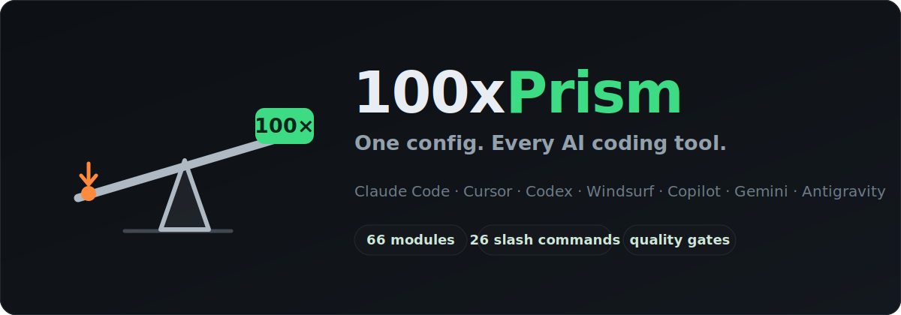

<div align="center">


# 100xPrism

### Stop vibe coding. Ship production-grade software.

[](https://github.com/rajitsaha/100xprism/releases/latest)
[](https://www.npmjs.com/package/100xprism)
[](LICENSE)

**One source of truth.** 66 modules generate native config for **Claude Code · Cursor · Codex · Windsurf · Copilot · Gemini · Antigravity**. Quality gates run on every commit.



</div>

---

## Install

**npm (any platform — macOS, Linux, Windows):**
```bash
npm install -g 100xprism && 100xprism install
```

**curl (macOS / Linux):**
```bash
curl -fsSL https://raw.githubusercontent.com/rajitsaha/100xprism/main/get.sh | bash
source ~/.zshrc   # or ~/.bashrc — activates the 100xprism command
```

Either way, `100xprism install` clones the toolkit to `~/100xprism` and provisions your AI tools. The npm package is a thin launcher — the modules, hooks, and plugins live in that clone, which `100xprism update` keeps current.

> **Windows:** plugin sync works, but native Windows module emit is being reworked ([#54](https://github.com/rajitsaha/100xprism/issues/54)). For full module support today, install under **WSL** with either method above.

**Set up a project:**
```bash
cd your-project && 100xprism init
```

**Keep up to date:**
```bash
100xprism update                    # pull latest, then add/update/remove skills + plugins
100xprism update --plugins-only     # refresh plugins only (repo already current)
npm install -g 100xprism@latest     # (optional) upgrade the launcher itself
```

`install` and `update` are **fully reconciling**, not append-only — every run:
- **adds** newly shipped skills, slash commands, and curated plugins,
- **updates** changed ones in place, and
- **removes** skills, slash-command aliases, and 100xprism-managed plugins that were deleted or merged upstream.

Your own hand-authored skills/commands and any plugins you enabled yourself are never touched. See [docs/USAGE.md](docs/USAGE.md#keeping-up-to-date) for details.

> **Cloned to a custom path?** The default install lives at `~/100xprism`. If you cloned elsewhere, update your shell + Claude Code config — see [Custom install location](docs/USAGE.md#custom-install-location).

---

## The pipeline

```
/understand → /context → /issue → /spec → /fix → /commit
                                                    ↓
              /techdebt ← /gate → /grill → /pr → /push → /release
```

Every `/commit` and `/push` runs a 5-point gate — tests, security, build, Docker, cloud. Nothing ships without passing.

---

## What you get

| | |
|---|---|
| **66 modules** | 26 slash commands + 40 auto-trigger skills — see [full reference below](#slash-commands) |
| **13 Claude Code plugins** | superpowers, playwright, github, hookify, claude-mem, understand-anything, ui-ux-pro-max, and more |
| **7 database engines** | Postgres, Cloud SQL, Snowflake, Databricks, Athena, Presto, Oracle — one `/db` interface |
| **27 SaaS CLIs** | `/connect` installs + authenticates GitHub, AWS, Stripe, Supabase, and more from `.env` |
| **4 project templates** | node-fullstack · node-frontend · python-api · docker-compose |
| **CI/Release pipelines** | Drop-in GitHub Actions for lint + real-DB tests + E2E + semantic-release |

---

## Slash commands

The following 26 slash commands are available. Run them inside Claude Code. In Codex, use the generated repo skill by name instead, for example `$gate`, `$commit`, or `/skills`.

### Lifecycle

| Command | What it does |
|:--------|:-------------|
| `/branch` | Create a conventional feature branch (`feat/`, `fix/`, `chore/`) |
| `/commit` | Gate → stage → conventional commit |
| `/grill` | Adversarial code review before opening a PR |
| `/pr` | Gate → push branch → create PR |
| `/push` | Gate → push → monitor CI → verify production health |
| `/release patch\|minor\|major` | Semantic versioning + publish to PyPI/npm/Docker Hub |
| `/launch` | Full deploy pipeline in one command |

### Quality

| Command | What it does |
|:--------|:-------------|
| `/gate` | **Mandatory** 5-point quality gate (tests, security, build, Docker, cloud) |
| `/test` | All test layers (unit, integration, E2E) — loops until 95% coverage |
| `/lint` | Auto-detect and fix all lint errors (ESLint, TypeScript, ruff) |
| `/security` | Vulnerability + secrets scan, auto-fix where possible |
| `/cloud-security` | GCP IAM, networking, PII, and compliance scan |
| `/eval` | Run module evals — check triggers and output quality |

### Engineering

| Command | What it does |
|:--------|:-------------|
| `/spec` | Turn a vague request into an implementation-ready spec |
| `/fix` | Autonomous bug fixer — CI failures, docker logs, Slack pastes |
| `/orchestrate` | Plan-first methodology for complex multi-step tasks |
| `/techdebt` | Dead code, duplication, stale TODOs |
| `/context` | 7-day git + GitHub activity dump — orient before coding |
| `/update-claude` | Write a CLAUDE.md rule after any correction |

### Data & Infrastructure

| Command | What it does |
|:--------|:-------------|
| `/db` | Query any of 7 database engines from one interface |
| `/query` | Plain-English analytics — describe what you want, get SQL |
| `/connect` | Install + auth 27 SaaS CLIs from `.env` |

### Documentation & Architecture

| Command | What it does |
|:--------|:-------------|
| `/docs` | Detect code changes and update documentation |
| `/issue` | Investigate a bug and create a detailed GitHub issue |
| `/architect` | Architectural Q&A and decision matrices |
| `/enterprise-design` | Full technical blueprint — IA, API, data model, stack |

### Auto-trigger skills (39)

These modules activate automatically when you describe a relevant task — no slash command needed.

| Category | Modules |
|:---------|:--------|
| **Marketing copy** | copywriting, copy-editing, cold-email, email-sequence, ad-creative, social-content |
| **SEO** | seo-audit, ai-seo, programmatic-seo, schema-markup, site-architecture |
| **CRO & conversion** | page-cro, signup-flow-cro, onboarding-cro, form-cro, popup-cro, paywall-upgrade-cro |
| **Growth & strategy** | content-strategy, marketing-ideas, marketing-psychology, launch-strategy, referral-program, churn-prevention, free-tool-strategy, ab-test-setup, analytics-tracking, pricing-strategy |
| **Sales** | sales-enablement, competitor-alternatives, paid-ads, revops, product-marketing-context |
| **Design** | enterprise-design, visual-system-architect, interaction-engineer, figma-translator |
| **Engineering** | subagents, terminal-setup |

---

## How it works in your tool

| Tool | Generated artifact | Auto-trigger? |
|:-----|:-------------------|:--------------|
| **Claude Code** | `~/.claude/skills/<slug>/` + slash command aliases | Yes — per description |
| **Cursor** | `.cursor/rules/<slug>.mdc` (one file per module) | Yes — per description |
| **Codex** | `AGENTS.md` + `.agents/skills/<slug>/` + `.codex/hooks.json` | Yes — repo skills |
| **Antigravity** | `ANTIGRAVITY.md` (core inlined + on-demand index) | Core only |
| **Windsurf** | `.windsurfrules` (size-budgeted) | Core only |
| **Copilot / Gemini** | `.github/copilot-instructions.md` / `GEMINI.md` | Core only |

Modules with `tier: core` (26) inline into single-file tools; `tier: on-demand` (39) appear as a compact index. In Claude Code, Cursor, and Codex, modules are also available as native skills/rules so full bodies load on demand. Claude Code plugins remain Claude-specific; use Codex `/plugins` for Codex-native plugins.

---

## Common CI traps it fixes

`npm install` 404 inside Docker · `useState(false)` opacity-0 breaking Playwright · integration tests silently excluded from the gate. [Full breakdown →](docs/ci-traps.md)

---

## More

- [Full usage guide](docs/USAGE.md) — daily patterns, multi-project setup, CI templates, project config, troubleshooting
- [Architecture](docs/v2-refactor.md) — why modules replaced workflows + skills
- [Token usage & optimization](docs/token-optimization.md) — audit your plugin/skill footprint and monitor token spend with the local dashboard
- [Changelog](CHANGELOG.md) · [Roadmap](ROADMAP.md) · [Issues](https://github.com/rajitsaha/100xprism/issues)

---

<div align="center">

Built by [Rajit Saha](https://www.linkedin.com/in/rajsaha/) · 23 years in enterprise data at Udemy, Experian, LendingClub, VMware, Yahoo

[](https://www.linkedin.com/in/rajsaha/)
[](https://github.com/rajitsaha)

If this saves you time, **[star the repo](https://github.com/rajitsaha/100xprism)**.

</div>
