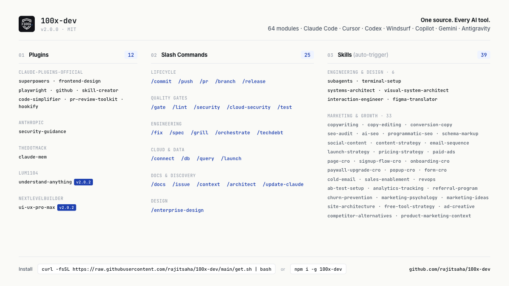

<div align="center">


# 100x Dev

### Stop vibe coding. Ship production-grade software.

[](https://github.com/rajitsaha/100x-dev/releases/latest)
[](https://www.npmjs.com/package/100x-dev)
[](LICENSE)

**One source of truth.** 65 modules generate native config for **Claude Code · Cursor · Codex · Windsurf · Copilot · Gemini · Antigravity**. Quality gates run on every commit.



</div>

---

## Install

```bash
# Mac / Linux
curl -fsSL https://raw.githubusercontent.com/rajitsaha/100x-dev/main/get.sh | bash
```
```
source ~/.zshrc   # or ~/.bashrc — activates the 100x-dev command
```

# Windows / anywhere with Node
npm install -g 100x-dev && 100x-dev install
```

```bash
cd your-project && 100x-dev init           # set up each project once
100x-dev update                            # pull latest modules + sync plugins
100x-dev update --plugins-only             # refresh plugins only (repo already current)
```

> **Cloned to a custom path?** The default install lives at `~/100x-dev`. If you cloned elsewhere (e.g. `~/work/git_udemy/100x-dev`), update your shell + Claude Code config to match — see [Custom install location →](docs/USAGE.md#custom-install-location).

[Full install guide →](docs/USAGE.md#installation)

---

## The pipeline

```
/understand → /context → /issue → /spec → /fix → /commit
                                                    ↓
              /techdebt ← /gate → /grill → /pr → /push → /release
```

Every `/commit` and `/push` runs a 5-point gate — tests, security, build, Docker, cloud. Nothing ships without passing.

---

## What you get

| | |
|---|---|
| **65 modules** | 26 slash commands (`/commit`, `/spec`, `/grill`, `/db`, `/eval` …) + 39 auto-trigger skills (copywriting, seo-audit, fix-bugs …) |
| **12 plugins** | superpowers, frontend-design, playwright, github, hookify, claude-mem, understand-anything, ui-ux-pro-max, … |
| **7 database engines** | Postgres, Cloud SQL, Snowflake, Databricks, Athena, Presto, Oracle — one `/db` interface |
| **27 SaaS CLIs** | `/connect` installs + authenticates GitHub, AWS, Stripe, Supabase, … from `.env` |
| **4 project templates** | node-fullstack · node-frontend · python-api · docker-compose |
| **CI/Release pipelines** | drop-in GitHub Actions for lint + real-DB tests + E2E + release |

[Full module reference →](docs/USAGE.md#using-the-workflows)

---

## How it works in your tool

| Tool | Generated artifact |
|:---|:---|
| **Claude Code** | `~/.claude/skills/<slug>/` + slash command aliases |
| **Cursor** | `.cursor/rules/<slug>.mdc` (per-module, auto-trigger) |
| **Codex / Antigravity** | `AGENTS.md` / `ANTIGRAVITY.md` (core inlined + on-demand index) |
| **Windsurf** | `.windsurfrules` (size-budgeted index) |
| **Copilot / Gemini** | `.github/copilot-instructions.md` / `GEMINI.md` |

Modules with `tier: core` inline into single-file rules tools; the rest stay token-cheap as an index. In Claude Code & Cursor every module auto-triggers from its description — **zero baseline token cost**.

---

## Common CI traps it fixes

`npm install` 404 inside Docker · `useState(false)` opacity-0 breaking Playwright · integration tests silently excluded from the gate. [Full breakdown →](docs/ci-traps.md)

---

## More

- [Full usage guide](docs/USAGE.md) — by-tool install, daily patterns, multi-project propagation, CI templates
- [Architecture](docs/v2-refactor.md) — why modules over workflows-vs-skills
- [Changelog](CHANGELOG.md) · [Issues](https://github.com/rajitsaha/100x-dev/issues)

---

<div align="center">

Built by [Rajit Saha](https://www.linkedin.com/in/rajsaha/) · 20+ years in enterprise data at Udemy, Experian, LendingClub, VMware, Yahoo

[](https://www.linkedin.com/in/rajsaha/)
[](https://github.com/rajitsaha)

If this saves you time, **[star the repo](https://github.com/rajitsaha/100x-dev)**.

</div>
